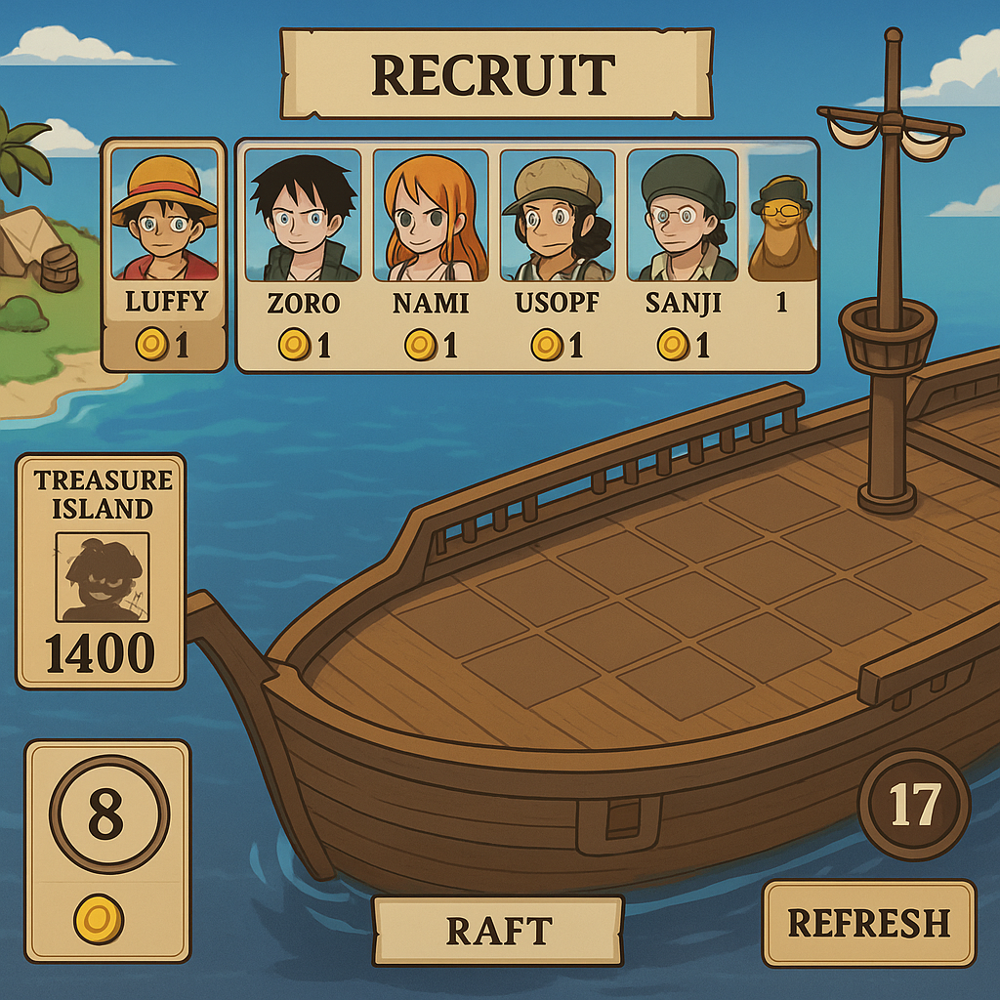

# CLAUDE.md

This file provides guidance to Claude Code (claude.ai/code) when working with code in this repository.

## Project Overview

Battle with Friends is a One Piece-inspired multiplayer auto-battler game built with:
- **Frontend**: React + TypeScript + Vite + Phaser 3 (game engine)
- **Backend**: Rust with SpacetimeDB (real-time multiplayer database)
- **Authentication**: OIDC via SpacetimeDB auth service
- **Deployment**: GitHub Pages (frontend), SpacetimeDB cloud (backend)

## Development Commands

### Client (Frontend)
```bash
cd client
npm install          # Install dependencies
npm run dev          # Start dev server on http://localhost:3000
npm run build        # Build for production
npm run preview      # Preview production build
```

### Server (Rust Backend)
```bash
cd server-rust
cargo build --target wasm32-unknown-unknown --release    # Build WASM module
spacetimedb publish battle-with-friends --clear-database  # Publish to SpacetimeDB
```

### Generate TypeScript bindings from Rust module
After publishing the Rust module, regenerate client bindings:
```bash
cd client/src
spacetimedb generate --lang typescript --out-dir ./autobindings --module-name battle-with-friends
```

## Architecture

### Three-Layer Architecture

1. **Rust Backend (SpacetimeDB Module)** - `server-rust/src/lib.rs`
   - Defines tables (Player)
   - Defines reducers (register_player, update_position, client_connected, client_disconnected)
   - Runs on SpacetimeDB, compiled to WASM

2. **React Layer** - Manages auth, state, and SpacetimeDB connection
   - `main.tsx`: OIDC authentication setup, SpacetimeDB connection initialization
   - `App.tsx`: Auth gate (shows login or game)
   - `SpacetimeDBProvider.tsx`: Context provider for SpacetimeDB connection
   - `GameWrapper.tsx`: Subscribes to Player table, syncs with Phaser via GameBridge

3. **Phaser Game Layer** - `client/src/game/`
   - `PhaserGame.tsx`: React component wrapper for Phaser canvas
   - `GameBridge.ts`: Communication bridge between React and Phaser (no React hooks in Phaser)
   - `scenes/MainScene.ts`: Main game scene with player rendering and input

### Data Flow

**SpacetimeDB → React → Phaser:**
- SpacetimeDB emits Player table updates
- GameWrapper listens via `playerTable.onInsert/onUpdate/onDelete`
- Updates are pushed to Phaser via `GameBridge.updatePlayers()`

**Phaser → React → SpacetimeDB:**
- Phaser detects input (keyboard/mouse)
- Calls `GameBridge.updatePosition(x, y)`
- GameWrapper calls `conn.reducers.updatePosition(x, y)` to SpacetimeDB

### Auto-generated Files

`client/src/autobindings/` contains TypeScript types and reducers generated from the Rust SpacetimeDB module. **DO NOT edit these files manually**. Regenerate them when the Rust module changes.

## Configuration

### Environment Detection (`client/src/config/spacetime.ts`)
Automatically detects environment and configures SpacetimeDB connection:
- **Local**: `ws://localhost:3000` → module `battle-with-friends`
- **Staging**: `wss://staging.spacetimedb.com` → module `battle-with-friends`
- **Production**: `wss://maincloud.spacetimedb.com` → module `battle-with-friends-maincloud`

### OIDC Configuration (`client/src/main.tsx`)
- Authority: `https://auth.spacetimedb.com/oidc`
- Client ID: `client_031CSnBZhPFgz5oj5Alo0a`
- Redirect URI: `${window.location.origin}/callback`

### Vite Configuration (`client/vite.config.ts`)
- Dev server: port 3000
- Base path: Uses `VITE_BASE_PATH` env var (set to `/battle-with-friends/` for GitHub Pages)
- CSP headers configured for dev environment

## Deployment

### Frontend (GitHub Pages)
GitHub Actions workflow (`.github/workflows/deploy.yml`) automatically builds and deploys on push to main:
1. Uses Bun to install and build
2. Sets `VITE_BASE_PATH=/battle-with-friends/`
3. Deploys `client/dist` to GitHub Pages

### Backend (SpacetimeDB)
Manually publish the Rust module:
```bash
cd server-rust
cargo build --target wasm32-unknown-unknown --release
spacetimedb publish battle-with-friends-maincloud --clear-database  # Production
# or
spacetimedb publish battle-with-friends                              # Dev/Staging
```

## Important Patterns

### Adding a New Reducer
1. Add reducer function in `server-rust/src/lib.rs` with `#[spacetimedb::reducer]`
2. Build and publish the module
3. Regenerate TypeScript bindings
4. Call the reducer from React: `conn.reducers.yourReducerName(...)`

### Adding a New Table
1. Define struct in `server-rust/src/lib.rs` with `#[spacetimedb::table(...)]`
2. Build and publish the module
3. Regenerate TypeScript bindings
4. Access table in React: `conn.db.yourTableName`
5. Subscribe to changes: `conn.db.yourTableName.onInsert/onUpdate/onDelete`

### React-Phaser Communication
- **Never import React hooks** into Phaser code
- Use `GameBridge` as the intermediary
- React side: calls `gameBridge.updatePlayers(...)`
- Phaser side: calls `bridge.updatePosition(...)` via callbacks

